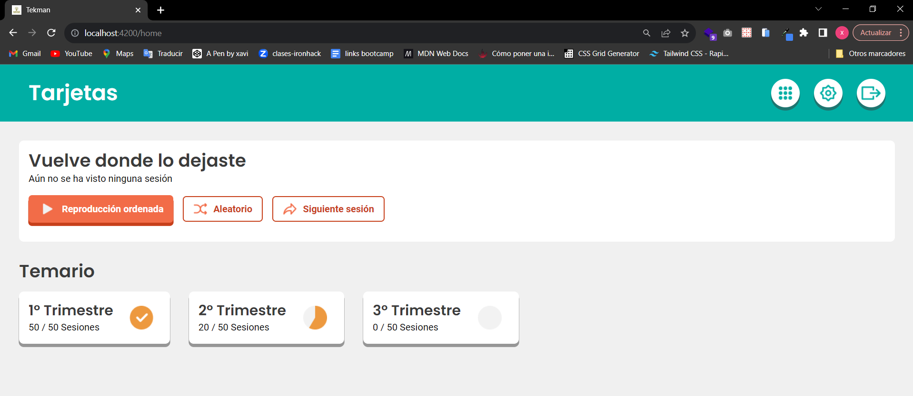

# Tekman

Este proyecto ha sido realizado con [Angular CLI](https://github.com/angular/angular-cli) versión 15.2.1.

## Aplicación

Esta aplicación es una prueva tecnica para la empresa Tekman.

En ella hay una página inicial con los siguientes componentes:

- Header: En este componente, se muestra un título y tres botones en la parte derecha. El segundo botón es funcional y abre la configuración, donde es posible cambiar el idioma de la aplicación entre catalán y castellano.

- Last session: En este componente, el usuario puede ver el título de la última sesión visitada y puede hacer clic en un botón para acceder a la página anterior, que muestra las sesiones disponibles.

- Syllabus: Aquí, el usuario puede ver los tres trimestres y la cantidad de sesiones completadas en cada uno. Se utilizan tres imágenes para representar el estado de las sesiones: una cuando aún no se han iniciado, otra cuando se ha visto al menos una sesión y, finalmente, una cuando se han visto todas las sesiones.

- Trimester: Si el usuario hace clic en uno de los trimestres, puede acceder a él para ver todas las sesiones disponibles. Al hacer clic en una sesión, se marca como vista y se redirige a la página anterior, que contiene la información sobre la sesión.

## Tencologías utilizadas

- Angular

- Routing

- Tailwind CSS

- ngx-translate

- HttpClient

- Google fonts

## Ejeccución aplicación

Clone el código y ejecute el comando `ng serve` para arrancar la aplicación. Navegue a `http://localhost:4200/`.
